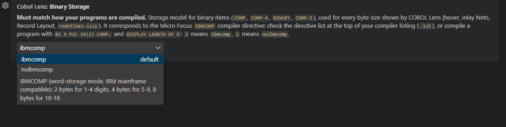

## Check your binary storage setting

The byte size of binary items (`COMP`, `COMP-4`, `BINARY`, `COMP-5`) depends on the Micro Focus **`IBMCOMP`** compiler directive. COBOL Lens assumes `IBMCOMP` by default (2 / 4 / 8 bytes).

If you compile **without** it (`NOIBMCOMP`, the Micro Focus default), set:

```json
"cobolLens.binaryStorage": "noibmcomp"
```

Otherwise the sizes shown in the hover, the inlay hints, the Record Layout panel and the `redefines-size` rule are wrong -- for example `PIC S9(2) COMP` is **1 byte**, not 2.

**How do I know which one I use?** Look for `IBMCOMP` in your compiler listing (`.lst`), or `DISPLAY LENGTH OF` a `PIC S9(2) COMP` field.


