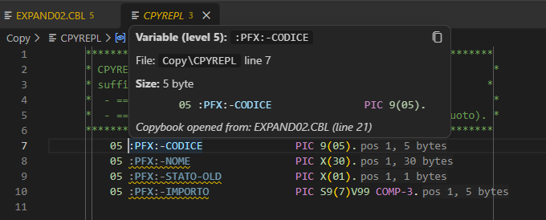

## Copybooks that know their program

A copybook on its own cannot tell whether its fields are used: that depends on the program that includes it. COBOL Lens now keeps track of where you came from.

- **Opened from a program** (`F12` or `Ctrl+Click` on the `COPY` name or on a field, the hover link, or the Copybook Dependencies tree): the copybook is linked to that program, and `unused-variable` checks the fields against the program -- including names renamed by `COPY ... REPLACING`. If the same copybook is included several times, only the inclusion you came from counts.
- **Opened by hand**: the rules that need the whole program (`unused-variable`, `undefined-variable`, `unused-paragraph`, `undefined-paragraph`) stay quiet, so you do not get a Christmas tree of warnings.

The hover on a field inside a copybook ends with its origin: *Copybook opened from: PROGRAM (line N)*.

